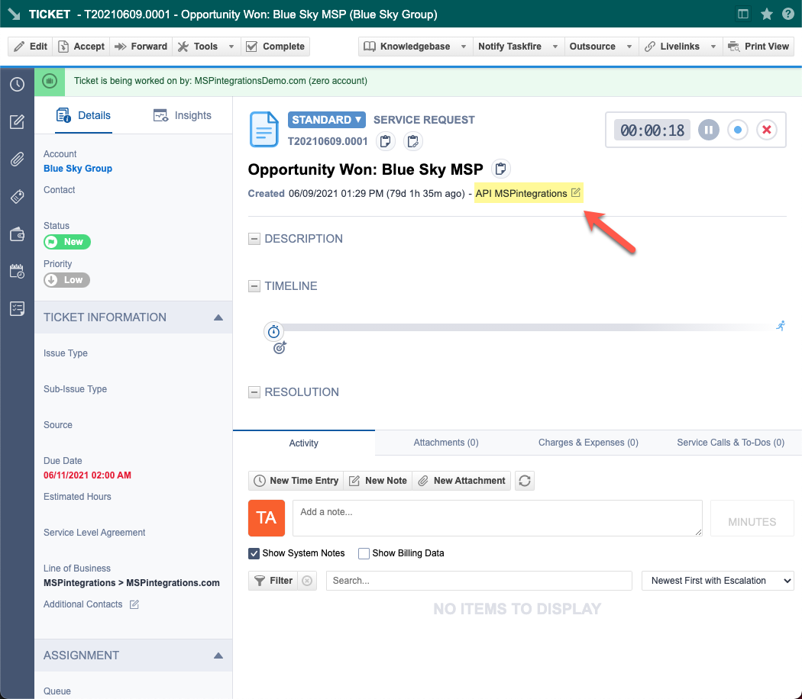
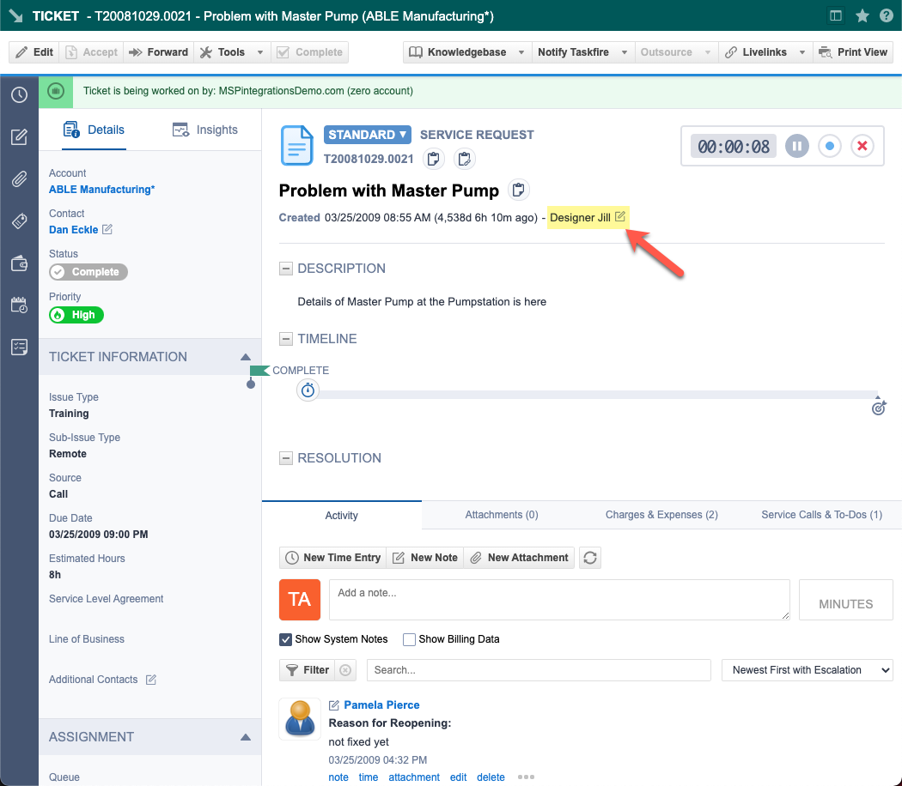

The Autotask API provides a method to impersonate an Autotask contact or resource (user) when creating tickets, ticket notes, and other API entities. When receiving an API call with contact or resource impersonation, Autotask will accept the API call as if the impersonated contact or resource made the request (as opposed to listing the call as being performed by the API integration user).

By using this impersonation feature, MSPintegrations can make Autotask API calls that create tickets, ticket notes, and other Autotask entities so that the Autotask user-interface shows that they were created by someone other than MSPintegrations.

## Use-Case for Impersonation

Impersonation is useful for improving the end-user experience in Autotask. By impersonating the person who took the action that caused MSPintegrations to create a ticket, ticket note, or other Autotask entity, the Autotask user-interface will display the name of the person who took that action and  the user who is responsible for the entity being created instead of the system that actually created the entity.

For example, if you use MSPintegrations to create Autotask Tickets from incoming emails, it is more useful for the ticket to display the name of the email sender as the "creator" of the ticket instead of simply displaying the name of your MSPintegrations Autotask API user. 

## Example Tickets

For example, compare the following two tickets. Both tickets were created by MSPintegrations using the Autotask API.

In this first ticket, "impersonation" was not used and the ticket shows that it was created by the Autotask user "API MSPintegrations". This is not helpful to an Autotask user who wants to determine who created the ticket.

In this second example, "impersonation" _was_ used and the ticket shows that it was created by a contact, and not by MSPintegrations. When viewing this ticket in the Autotask interface, the name of the person who caused the ticket to be created will be more useful than the name of the Autotask API user used by MSPintegrations.

## Using Impersonation

To initiate an API call to Autotask with contact or resource impersonation, you should populate the appropriate field for the call. Each Autotask database entity may have a different name for the impersonation field, but it will typically be similar to [ui-element]CreatedByContactID[/ui-element], [ui-element]CreatedByResourceID[/ui-element] or [ui-element]AttachedByContactID[/ui-element].

## What's Next

* [Create API Security Level with Impersonation](email2at/configure/autotask/create-api-security-level-with-impersonation.md)
* [Update your Autotask API User to allow Contact and Resource Impersonation](email2at/configure/autotask/update-api-user-for-impersonation.md)

## Other Resources

* [Autotask Help Document: Web Services API security settings](https://www.autotask.net/help/Content/4_Admin/1CompanySettings_Users/ResourcesUsersHR/Security/Settings_WSAPI.htm?cshid=1605)
* [Autotask Help Document: REST API security and authentication (see "Impersonating resources and contacts" section)](https://www.autotask.net/help/DeveloperHelp/Content/APIs/REST/General_Topics/REST_Security_Auth.htm)
