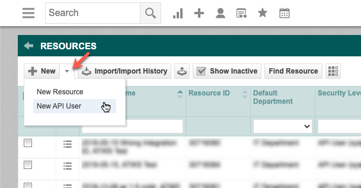

To create a new Autotask resource with access to the Autotask API:

1. Login to Autotask
2. Hover the top-left Autotask mega-menu; hover [ui-element]Admin[/ui-element]; click [ui-element]Resources (Users)[/ui-element]
3. At the top-left, to the right of the [ui-element]New[/ui-element] button, click the [ui-element]down-arrow[/ui-element] and click [ui-element]New API User[/ui-element]
   
4. In the [ui-element]General[/ui-element] section:
    1. Enter a [ui-element]First Name[/ui-element] (example: [type]MSPintegrations[/type])
    2. Enter a [ui-element]Last Name[/ui-element] (example: [type]API[/type])
    3. Enter an [ui-element]Email Address[/ui-element]
        * This does not have to be a valid email address
        * We suggest using [type]mspintegrations@yourdomain.com[/type] (change _yourdomain.com_ to your domain)
    4. In the [ui-element]Security Level[/ui-element] field, select [type]API User (system)[/type]
       
5. In the [ui-element]Credentials section[/ui-element]:
    1. Click [btn]Generate Key[/btn]
    2. Click [btn]Generate Secret[/btn]
> Note the values in the [ui-element]Username[/ui-element] and [ui-element]Password[/ui-element] fields. You will need to provide these to MSPintegrations.
6. In the [ui-element]API Tracking Identifier[/ui-element] section:
    1. Click the radio button for [ui-element]Integration Vendor[/ui-element]
    2. In the [ui-element]Integration Vendor[/ui-element] pull-down, select [/ui-element]MSPintegrations – Email2AT[ui-element]
7. At the top of the window, click [btn]Save & Close[/btn]