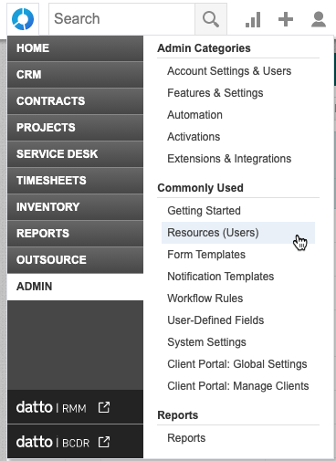
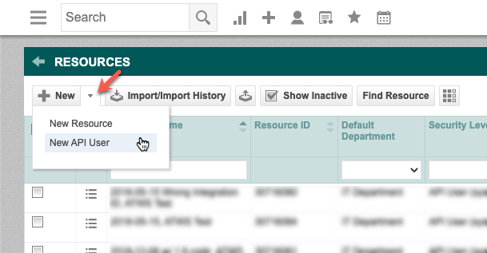
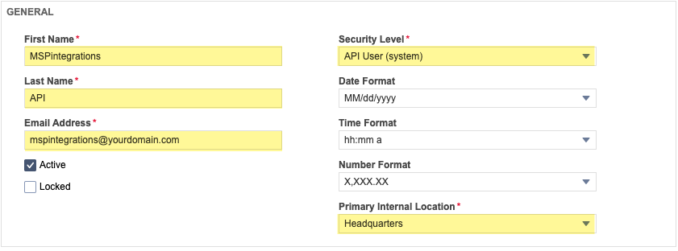
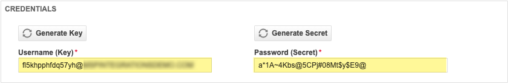
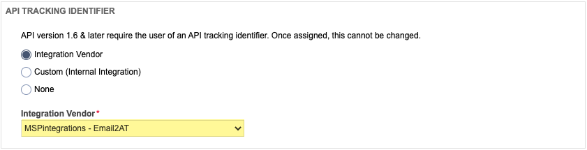

In this procedure, you will create a new API user in your Autotask instance. You can then add this Autotask API user to MSPintegrations so that MSPintegrations can connect to Autotask to create, update, query, and delete items using the Autotask API.

> **Requirement:** In order to complete the following steps, you will need to login to Autotask as a user with full administrative rights.

To create a new Autotask API user:

1. Login to [Autotask](https://www.autotask.net/)
2. Hover the top-left Autotask mega-menu; hover [ui-element]Admin[/ui-element]; click [ui-element]Resources (Users)[/ui-element]

3. At the top-left, to the right of the [ui-element]New[/ui-element] button, click the [ui-element]down-arrow[/ui-element]; click [ui-element]New API User[/ui-element]

#### [ui-element]General[/ui-element] section:

1. Enter a [ui-element]First Name[/ui-element] (example: [type]MSPintegrations[/type])
2. Enter a [ui-element]Last Name[/ui-element] (example: [type]API[/type])
3. Enter an [ui-element]Email Address[/ui-element] 
   * This does not have to be a valid email address 
   * We suggest using [type]mspintegrations@yourdomain.com[/type] (change [type]yourdomain.com[/type] to your domain)
4. In the [ui-element]Security Level[/ui-element] field, select [ui-element]API User w/ Full Impersonation Rights[/ui-element]
   * If there is no option for [ui-element]API User w/ Full Impersonation Rights[/ui-element], choose [ui-element]API User (system)[/ui-element] and complete the rest of the steps in this procedure. When you have complete this procedure, proceed to complete the following two procedures:
   * [Create API Security Level with Impersonation](email2at/configure/autotask/create-api-security-level-with-impersonation.md)
   * [Update your Autotask API User to allow Contact and Resource Impersonation](email2at/configure/autotask/update-api-user-for-impersonation.md)
5. Choose an appropriate option for [ui-element]Primary Internal Location[/ui-element]

#### [ui-element]Credentials[/ui-element] section: 

   1. Click [btn]Generate Key[/btn] 
   2. Click [btn]Generate Secret[/btn]
> Note the values in the [ui-element]Username[/ui-element] and [ui-element]Password[/ui-element] fields. You will need to provide these to MSPintegrations. 

#### [ui-element]API Tracking Identifier[/ui-element] section:

   1. Click the radio button for [ui-element]Integration Vendor[/ui-element] 
   2. In the [ui-element]Integration Vendor[/ui-element] pull-down, select [ui-element]MSPintegrations – Email2AT[/ui-element] 

#### Save & Close
At the top of the window, click [btn]Save & Close[/btn]